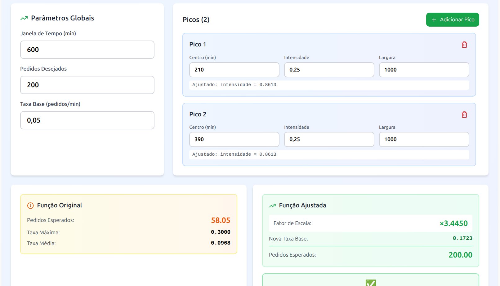
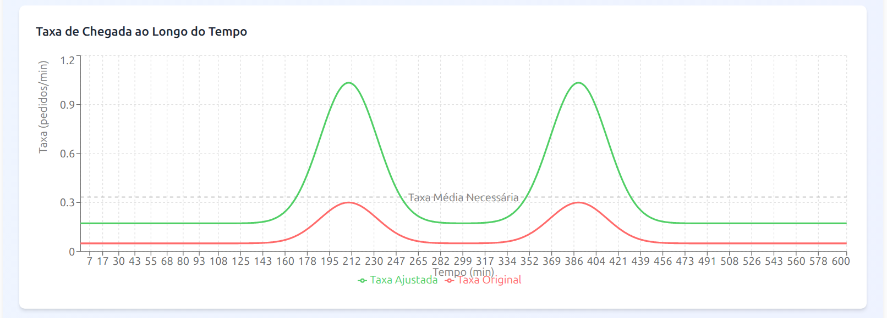
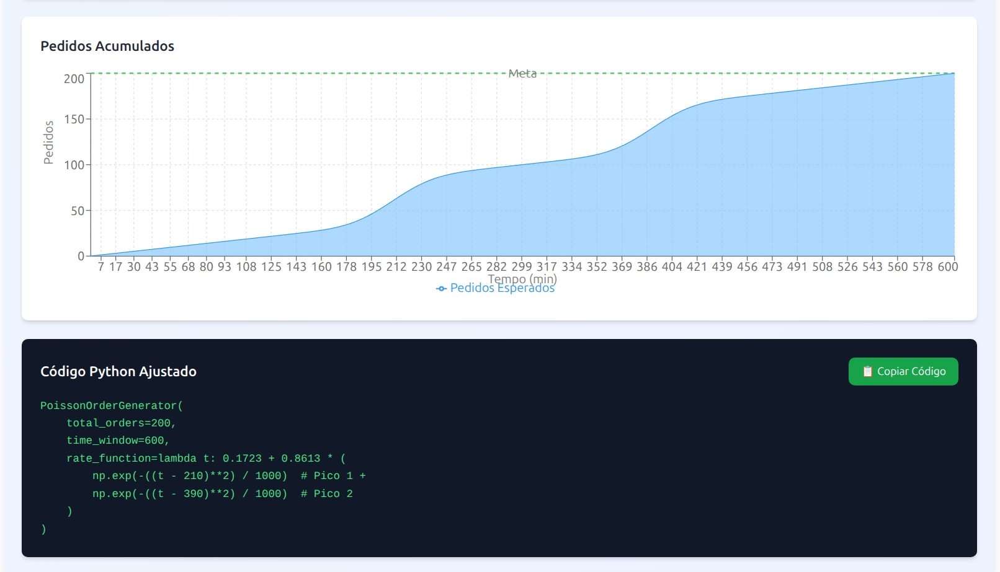

# 🎯 Poisson Tuner

Ferramenta visual para criar e calibrar funções de taxa λ(t) para o **Processo de Poisson Não Homogêneo**, utilizado na geração de pedidos do [FoodDeliveryGymEnv](https://github.com/MarquinhoCF/food-delivery-gym).

---

## 📐 A Matemática por Trás

### Processo de Poisson Homogêneo

No processo de Poisson clássico, a taxa de chegada λ é **constante no tempo**. O número esperado de eventos em um intervalo `[0, T]` é simplesmente:

```
E[N(T)] = λ · T
```

Isso é útil para modelar situações uniformes, mas não reflete a realidade de um serviço de entrega, onde a demanda varia ao longo do dia.

---

### Processo de Poisson Não Homogêneo

No processo não homogêneo, a taxa de chegada varia com o tempo: **λ(t)**. O número esperado de eventos em `[0, T]` passa a ser a integral da função de taxa:

```
E[N(T)] = ∫₀ᵀ λ(t) dt
```

Para simular picos de demanda (horário de almoço, jantar, etc.), o **Poisson Tuner** usa uma soma de funções gaussianas sobre uma taxa base:

```
λ(t) = base_rate + Σᵢ intensidade_i · exp(−(t − centro_i)² / largura_i)
```

Onde cada termo gaussiano representa um **pico de demanda**:

| Parâmetro | Significado |
|-----------|-------------|
| `base_rate` | Taxa mínima de chegada de pedidos (pedidos/min) fora dos picos |
| `centro_i` | Instante (em minutos) onde o pico i atinge seu valor máximo |
| `intensidade_i` | Altura do pico — quanto acima da taxa base ele chega |
| `largura_i` | Dispersão do pico — valores maiores resultam em picos mais largos e suaves |

---

### O Problema do Ajuste de Escala

Ao definir os parâmetros manualmente, é difícil garantir que a integral da função resulte exatamente no número de pedidos desejados. Dado um alvo `N_target`, o fator de escala necessário é:

```
scaleFactor = N_target / ∫₀ᵀ λ(t) dt
```

A função ajustada fica:

```
λ_ajustada(t) = scaleFactor · λ(t)
```

O **Poisson Tuner** calcula esse ajuste automaticamente, exibindo os novos valores de `base_rate` e `intensidade` para cada pico, de forma que `E[N(T)] = N_target`.

---

### Método de Thinning (para a simulação)

Para gerar eventos a partir de λ(t), o simulador usa o **método de thinning (afinamento)**. Ele requer a taxa máxima da função:

```
λ_max = max{ λ(t) : t ∈ [0, T] }
```

O Poisson Tuner exibe esse valor diretamente no painel de resultados, pronto para ser usado como parâmetro `max_rate` no simulador.

---

## 🖥️ A Ferramenta

O Poisson Tuner é uma interface React que permite configurar, visualizar e exportar a função λ(t) de forma interativa, sem precisar calcular nada manualmente.

### Configuração dos Parâmetros

Configure a janela de tempo, o número de pedidos desejados e a taxa base. Adicione quantos picos quiser, controlando individualmente o centro, a intensidade e a largura de cada um. A ferramenta mostra em tempo real os valores ajustados de intensidade para cada pico.



---

### Visualização da Curva λ(t)

O gráfico exibe a taxa de chegada ao longo do tempo, comparando a função original (com os parâmetros inseridos) e a função ajustada (escalonada para bater com o número de pedidos desejados). A linha tracejada indica a taxa média necessária para atingir a meta.



---

### Pedidos Acumulados e Código Gerado

O gráfico de área mostra os pedidos acumulados esperados ao longo do tempo, com a linha de meta bem visível. Ao final da página, o código Python pronto para copiar e colar diretamente no arquivo JSON do cenário experimental é exibido e pode ser copiado com um clique.



O código gerado segue o formato esperado pelo `FoodDeliveryGymEnv`:

```python
PoissonOrderGenerator(
    total_orders=200,
    time_window=600,
    rate_function=lambda t: 0.1723 + 0.8613 * (
        np.exp(-((t - 210)**2) / 1000)  # Pico 1 +
        np.exp(-((t - 390)**2) / 1000)  # Pico 2
    )
)
```

---

### Importação de Código Existente

Já tem uma `rate_function` definida? Cole o código no painel de importação e a ferramenta parseia automaticamente os parâmetros, carregando-os nos controles para que você possa ajustá-los visualmente.

---

## ⚙️ Instalação

### 1️⃣ Instalar o Node com NVM

Se ainda não possui o `nvm`, instale com:

```bash
curl -o- https://raw.githubusercontent.com/nvm-sh/nvm/master/install.sh | bash
```

Depois **recarregue o terminal**:

```bash
source ~/.bashrc
```

Verifique se funcionou:

```bash
nvm --version
```

### 2️⃣ Instalar a versão correta do Node

O projeto requer **Node.js 20.19.0** (compatível com Vite).

```bash
nvm install 20.19.0
nvm use 20.19.0
```

### 3️⃣ Instalar as dependências

```bash
cd poisson-tuner
npm install
```

---

## ▶️ Executando o Projeto

```bash
npm run dev
```

Acesse no navegador: `http://localhost:5173`

---

## 🔗 Projetos Relacionados

- [Food Delivery Gym](https://github.com/MarquinhoCF/food-delivery-gym) — simulador de entrega de última milha onde as funções geradas aqui são utilizadas